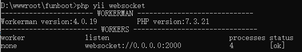
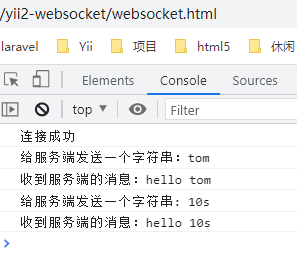
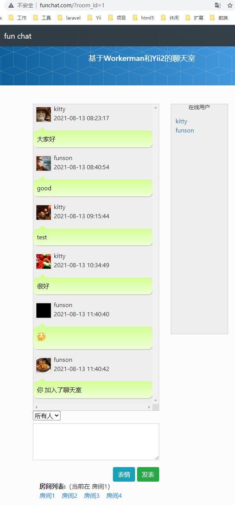

## Yii2 WebSocket 基于Workerman，带聊天室样例

简单演示，正式项目请参考Funboot的chat聊天室如何和Yii2紧密结合

### 问题反馈

在使用中有疑问欢迎在QQ群众反馈 QQ群：[798843502](https://jq.qq.com/?_wv=1027&k=9Hw7mPGf)


### 演示聊天室地址

- https://chat.funboot.net/

### 安装
  
composer执行

```
composer require funson86/yii2-websocket
```

或者在 `composer.json` 加入

```
"funson86/yii2-websocket": "^1.0",
```

也可以直接加入workerman的扩展

```
composer require workerman/workerman
composer require workerman/gateway-worker
```

或者

```
      "workerman/workerman": "^4.0",
      "workerman/gateway-worker": "^3.0",
```

### 演示

将WebsocketController.php拷贝到yii2项目的console/controllers目录下

命令行下执行执行 php yii websockt




浏览器打开websocket.html，在console中可以看到




### 最佳实践

可以参考Funchat基于workerman和Yii2结合实现有历史消息的聊天室

将backend common console web 拷贝到目录下，在每个目录的main.php中添加

```
        'chat' => [
            'class' => 'frontend\modules\chat\Module',
        ],
```

具体参考 https://github.com/funson86/funboot/blob/master/docs/guide-zh-CN/dev-websocket.md




### 参考

- http://doc.workerman.net/getting-started/simple-example.html
